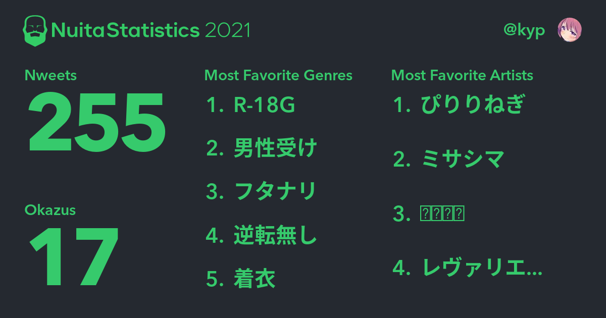

気づいたら年末になっていました。時間の感覚がなく、週報も書き忘れていました。

### 引越し先を決めた

引越し先を決めました。最近土日は半分くらい内見に行っていたのでわりと忙しく、時間の感覚がなくなった原因はこれかもしれません。

状況としては週 5 フルリモートワークで、本当は関東を脱出したいけどそれだけの勇気もなく、でも広くて安いお家に住みたい！という感じでした。

そして最初は茨城とか埼玉で探してて、実際内見に行ったりしてたんですけど、結局東京の西側に借りることになりました。審査で落ちたりしなければ 1 月末から一人暮らし再開です。深夜にペヤング食べたりできます。やったー！

#### 家を借りるとはどういうことか？

情けない話なんですけど、家を借りるとお金がかかるし、お金がかかるから働かなきゃいけなくなります。贅沢するためというより生きるためにお金が必要になり、金なんていらねえよ！みたいな気持ちだけでは生きていけない気がします。というか仕事が必要で、やりたいことだけやって生きていけなくなる。この覚悟を決めるのが本当に難しくて、引っ越しを決意してからだらだら半年くらい過ごしてしまった……。

大学時代は 8 時間寝て寝るのに飽きたら起きて、やりたいことをやって飽きたら寝るみたいな生活をずっとしてきたし、いつでもまた再開したいと思ってたんですが、お金が必要になるので今後は難しくなります。泣きそう。毎日のサイゼリヤ代を出すために働いているのに、やりがいとかキャリアパスとかを問われ続け、そのたびに偽りのモチベを語って自分を騙し、会社のあるあると職種の内輪ネタで盛り上がり、いつか仕事を始める前に描いていた本当の夢も分からなくなります。助けてほしい。

……いや、完全に働きたくないわけじゃないんだけど（会社の人用）、金銭的な必要から他の選択肢が奪われてしまうのはかなりつらい。全てに飽きたら全部放り出して YouTuber になったりしたい。

 

でも、家を借りてしまったので、今後はどうにか頑張って生きるのに必要なお金を得ます。がんばります。助けてください。

### Nuita Statistics 2021

[Nuita Statistics 2021](https://twitter.com/nuita_net/status/1474330428584919045)というのを作っていました。

結局 Twitter 上にただデータを載せるだけになっちゃったんですけど、本当はもっと大掛かりな仕組みで、Web 上の特設ページとユーザーごとの統計、そして Twitter 用のシェア画像まで作る予定でした。

<i>Twitter用のシェア画像。見て分かる通り未完成である</i>

 

Rails のバッチから DynamoDB に統計用のデータを入れて、API Gateway と Lambda でデータを返すだけの簡単なエンドポイントを作って Next.js でウェブページとしてして、それをさらに別の Lambda から Puppeteer で撮影して S3 に収める……みたいなことをやろうとしていました。

分かっています。オーバーエンジニアリングです。

そして私は敗北しました。このままのペースなら年末年始の休みには終わるかな……って思ったところで遅すぎることに気づきました。どうせ誰にも見せない趣味開発なので、イケてるアーキテクチャとか考える必要ないです。今後も ConoHa の VPS 上で直接 Rails と DB 動かしてやっていきます。

### ねんまつ

年末だー！！！

毎年 1 年間を振り返って、その年の始めには思いもしなかったことをしていたら最高の 1 年だった、みたいに感じています。社会人 2 年目になってどうなるかと思いましたが、仕事先で色々なことがあって今年も予想外な感じになっていました。安心！

休みが 4 日しかないんで年末という感じは全くないんですけど、来年も予想できない感じに生きていきたいです。できればインターネットの活動で書ける感じのサプライズが欲しいです。仕事で予想を裏切られても何も書けることがない……。

#### 来年も生き残りたい

生きましょう
