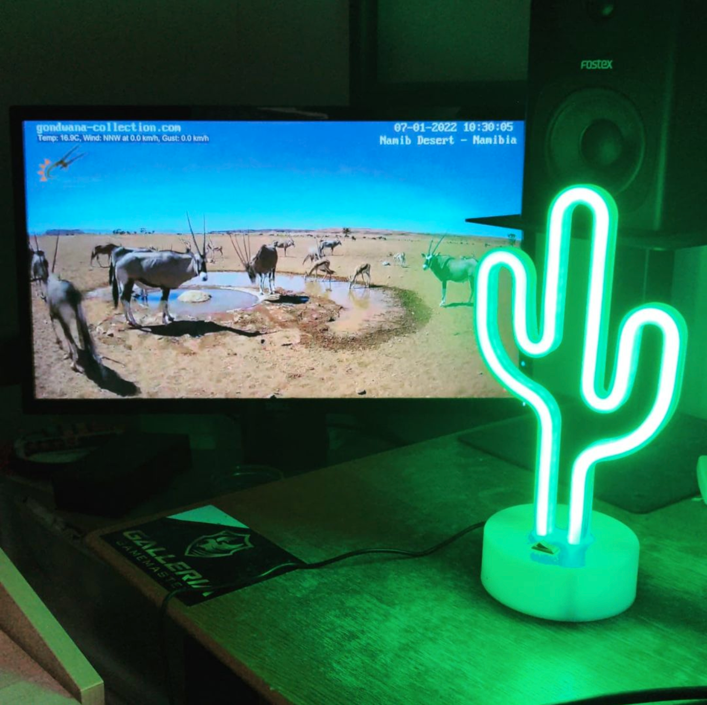
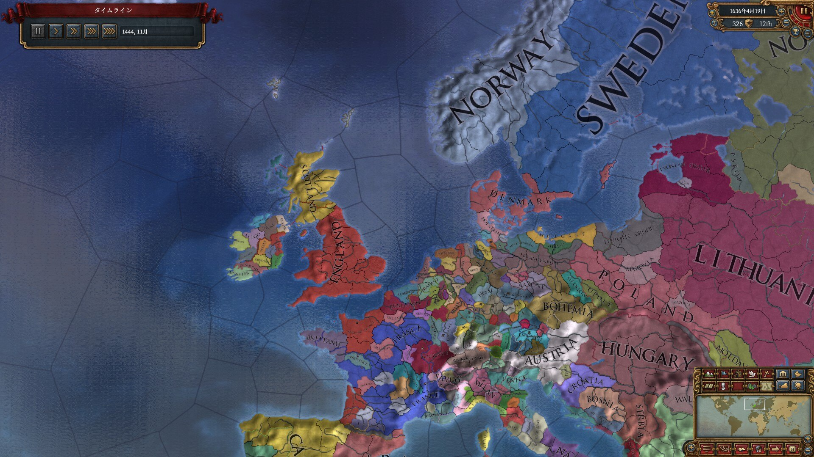
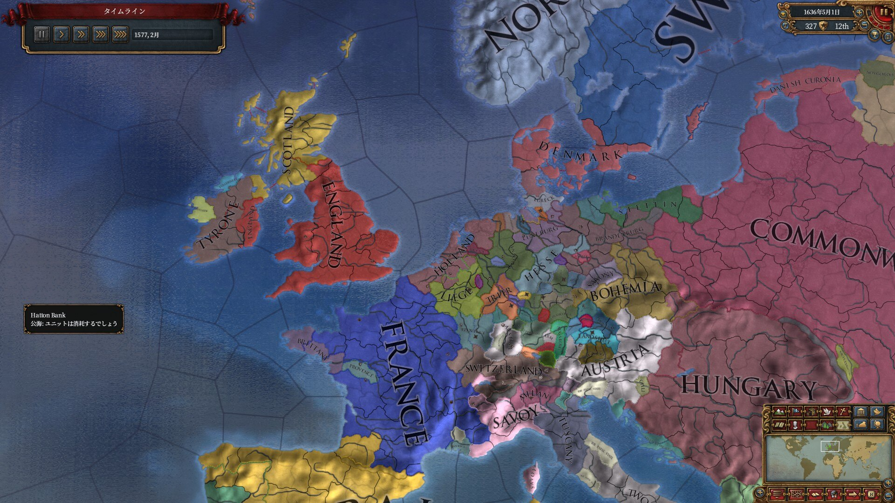
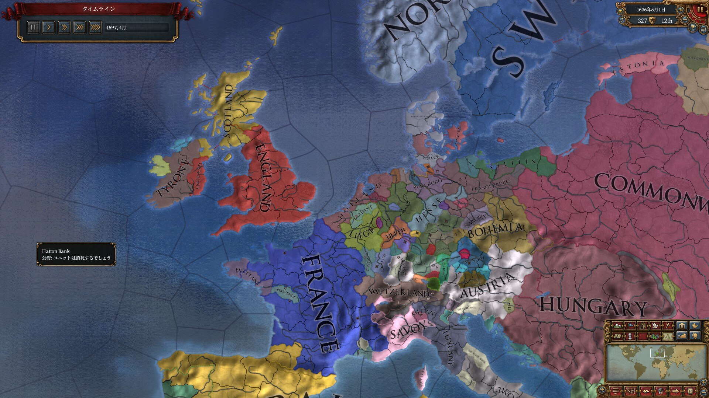

週報です。週とは？

# あけましておめでとうございます

おめでとうございます。

毎年なんだかんだ親戚の正月的なイベントに付き合っていた気がしますが、今年は全てを放棄してほぼ家にいたので、お正月感も年越し感もあんまり感じませんでした。

おかげでちょっとだけNuitaの開発も進んで、ヌイートの公開範囲が設定できるようになりました。昨年の1月くらいに、「Nuitaを（射精報告とかしない）普通の人にも使ってもらうためにはどうすればいいんだろう？」と思っていたことがこれでだいたい全て実現できたことになるので、一旦やりきった感がすごい……。

今後しばらくは細々した修正を加えつつ、折を見て宣伝とかもしていけたらと思います。射精報告で世界を変えよう！

# 誕生した

あと誕生日でした。祝ってくれって言ってるみたいでインターネットでは黙ってるつもりだったんですけど、ついポロッと言ってしまって、そしたらお祝いのリプとかもらいました。やったー！

あと、ゲーム仲間に欲しい物リストをれ見よがしに貼ったらLED照明とかもらいました。月末の引っ越しに向けてオシャレな家具とか集めてるとこだったので、嬉しかったです。

<i>オタクは光ってるものが好き</i>

 

絶望的に片付けが苦手で、今まで住んだ場所を全てゴミ屋敷にしてきてる実績があるんですけど、だからこそ最初の住み始めの段階で人に見せられる部屋を作っておけば、さすがにサステナブルな暮らしができるのではないかと思っております。がんばります。とりあえずプレゼントありがとうございました。

# EU4

[Europa Universalis IV](https://store.steampowered.com/app/236850/Europa_Universalis_IV/?l=japanese)というゲームがあります。1444年から1820年までの世界の歴史シミュレーションゲームで、実在したすべての国を自由に選んで自分だけの歴史を紡いでいくことができます。

学生のときは英語でできるぜ！って無理に英語で始めて、言葉読めんし訳わからんつって途中で投げるのを繰り返してたんですけど、日本語MOD入れたらフレーバーテキストも読めて格段に面白くて、やっと最近ゲームのメカニズム的なところも分かってきた……って感じになります。（ここまでプレイが100時間なので、パラドゲーとしては初心者に入りそう）

で、始めての小国プレイとしてホラント王国を選んでみました。史実ではブルゴーニュ卿の領地からスペイン・ハプスブルク家の持ち主になって、16世紀末にネーデルラントとして一体となって独立、そのままスペイン・ポルトガルの交易網を乗っ取って世界交易を支配する覇権国家へ……という流れだったと思います。

<i>ゲーム開始直後のホラント。いや小さすぎてよく分からないです</i>

 

が、プレーヤーとして出来ることの少ない従属国をプレイするのはあまりに苦痛なので、ゲームのプレイ開始直後に同じくブルゴーニュ家の支配下にあるフリースラント、そしてスペインの前身たる大国カスティーリャと同盟し、ブルゴーニュ相手の独立戦争を戦い、見事勝利して独立を勝ち取りました。この後ブルゴーニュはあらゆる周辺国や従属国に戦争を仕掛けられ、ものの数十年で小国へと落ちてしまいます。

ただ、史実と異なりバラバラに独立してしまったことで、次にネーデルラントを統一する作業をしなければならなくなりました。イギリス海峡の交易を握っていることで予算には余裕があり、結果として軍隊は大きくできているのですが、一番の敵はAE（侵略的拡大）と呼ばれるパラメータです。これは史実の外交包囲網を再現したもので、あまりに周辺諸国に侵略戦争をしかけ続けているとヘイト(AE)が溜まり、やがて一定値に達すると周辺諸国に対プレーヤー包囲網を組まれ、懲罰戦争という名の下で多方面戦争を仕掛けられるというものです。

この値の存在は知っていたのですがあまり気にしていなかったところ、独立国家のユトレヒトを侵略し一発併合したところで対ホラント包囲網を組まれ、ほぼ全ての周辺国家相手に戦うことになりました。とはいえ以前からお金を贈ったりして仲良くしていたフランスとオーストリアがホラント側についてくれたため、小国の寄せ集めである包囲網軍を撃破し、逆に調子に乗って包囲網の盟主であるリューベックからシュレスヴィヒ地方を奪うことにすら成功しました。

<i>1577年のホラント。フランスの北東に誇らしげに「HOLLAND」の文字が踊る。ちゃっかりデンマークの南に飛び地まで持っている</i>

 

で、ここからがプレミなのですが、1500年代に入ってからヨーロッパでは宗教改革が始まり、プロテスタントや改革派（カルヴァン派）等が発生し始めていました。で、低地諸国には史実通りカルヴァン派が広まり始め、南部からはやや遅れたもののホラントにも改革派が浸透し始めました。（史実であればこのタイミングで厳しく異端を取り締まる宗主国スペインに対して反乱が起こり、オラニエ公ウィレムの下でネーデルラントが独立に成功します）

ここで僕は何も考えておらず、オランダならやっぱりカルヴァン派でプロテスタンティズムの倫理だろ！ってことで改宗を実行、ホラント国自体の宗教を改革派に設定してしまいました。すると威信が急激に低下し、さらにはフランス、オーストリアといった同盟国は皆カトリック国家だったため関係が悪化、しかもそのタイミングで第二弾の対ホラント大同盟が結成されてしまいました。

しかもしかも、オーストリアはポーランド＝リトアニア帝国との戦争状態にあり、何かと思えばハプスブルク家の血筋が途絶えたらしく、ハンガリーとポーランド＝リトアニアがオーストリアを巡って継承戦争をしているではありませんか！この戦争にはポーランド＝リトアニアが勝利、しかしオーストリアは同君連合の下位国となってしまったため同盟を破棄され、フランスも微妙な感じで第2次懲罰戦争にボロ負けし、せっかく集めたブラバント3州を独立国家として解放させられるということになりました。

その休戦期間中、カトリックであるリエージュが相次いでネーデルラント諸国に侵攻しました。これはバリバリの宗教戦争で、低地諸国の住民はほとんどが改革派あるいはプロテスタントの信者にも関わらず、戦争に負けた各国はカトリックに改宗されてしまいました。このゲームには信仰の擁護者というシステムがあり、威信のある国家は500ダカットを払って信仰の擁護者になることができます。すると同じ宗教を信じている国家が他宗教の国家から宣戦布告された場合、信仰の擁護のためとして介入することができます。カトリックはかつての友であったカスティーリャが強大化したスペインが擁護者となっていて、とても戦える相手ではなく、しかも周辺の大国は全てカトリックであるために同盟国家を探すことすらできず、困り果ててぐわーーーってなったところでお正月が終わりました。

<i>1597年のホラント。南側、リージュとの間に水色のブラバント王国が出来ている。このブラバントもカトリック化しているため、スペインに勝たなければ再併合できない</i>

 

無念。

しかしゲームの内容でこれだけ週報を埋められるのでEU4というかパラドゲーはすごいです。調子に乗って[物語 オランダの歴史](https://www.amazon.co.jp/dp/B07FDTV5SP)という本まで買ってしまいました。あとで読みます。お疲れ様でした。
