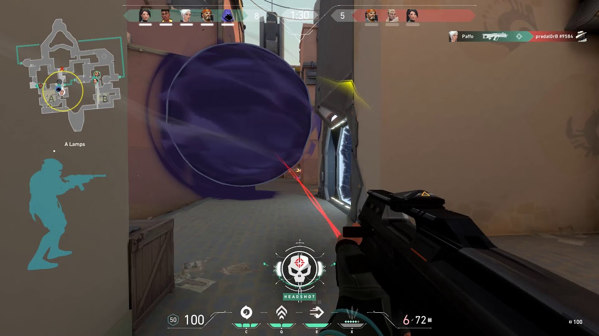

この記事には Outer Wilds のネタバレが含まれます。  
まだクリアしてない人は読まないでね。

<iframe src="https://store.steampowered.com/widget/753640/" frameborder="0" width="646" height="190"></iframe>

最近 Outer Wilds をクリアした。合計 30 時間くらい。

いくつかネット上のヒントを見てしまい、クリアした今はすごく後悔してるんだけど、ゲーム自体はすごい体験だった。特にエンディングが好き。三体の最終巻とか、スケールがデカくなって文明とか宇宙そのものが相対化される展開が大好物なのだ。

だけど、アクションが苦手なのもあり、プレイしてる最中は常に苦しかった。特に脆い空洞のブラックホール。最初に訪れた惑星で、自分は何十回もブラックホールに落ち続けた。しかもプレイ中、終盤までホワイトホールステーションの起動の仕方が分からなくて（装置をオンにする必要があるの気づかなくない？）、だから探索中ブラックホールに吸い込まれる → 絶望 → ゲーム終了を何度も繰り返した。そういうわけで、ブラックホールは本能的な恐怖の対象となり、脆い空洞でブラックホールを見るたびに変な手汗が出るようになっていた。

<small>本当に嫌い</small>

...で。Outer Wilds をクリアした数日後、VALORANT という FPS をプレイしていて、そこで再び恐怖を感じた。認識より先に飛び込んでくるタイプの恐怖だ。画面をよく見ると、画面中央には黒い球体があった。

<small><a href="https://valorant-5chnews.com/archives/5742">出典</a></small>

それはオーメンの 1way スモークと呼ばれるアビリティの使用法で、VALORANT では頻出のテクニックだし、自分も Outer Wilds をプレイする数年前から知っていたはずだった。視界を塞ぐだけのオブジェクト。なのに、自分はこの画面を見てまず恐怖を感じ、しばらく息が浅くなった。次いでこれがオーメンの 1way スモークだと気づいて、どうしてこんなに怖いんだろうと数秒考えた結果、Outer Wilds のブラックホールとの類似性に気付いた。それくらい、意識を飛び越えて脳に恐怖が刻み込まれていたのだ。

  

で、まあ、何が言いたいのかというと...ゲームオーバーの体験って、わりと脳の深いところに刻まれるっぽいということだ。死の疑似体験なのかもしれない。Outer Wilds のブラックホール、砂場、アンコウあたりへの恐怖は脳に刻み込まれている。消えても誰にも惜しまれない。

ふと、SAEKO の体験版にもらったいくつかの感想を思い出した。「冴子の手が動くたびにとてつもない恐怖を感じる」。正直なところ、大げさすぎないかと思っていた。でも、Outer Wilds をプレイした今なら分かる。冴子に殺されて、１からイベントをやり直す経験を何度かすれば、死の間際に映る手は、同じように本能的な恐怖の対象になるだろう。

SAEKO は絶賛開発中で、ときどきゲームデザインや UX について考えたりする。自分はあんま死にゲーが好きじゃないし（ムカつくから）、プレイヤーにはあまりストレスを感じてほしくないな〜と思っている。でも、Outer Wilds で毎回あの焚き火に戻されるみたいに、ストレスを与えることで得られる経験みたいなのもあるかも。SAEKO の今の仕様は、無意識のうちにだけど、それをうまく使えるのかな〜と思った。

  

本当は SNS にスイって投稿して終わらせるはずだったんだけど、どう頑張ってもネタバレになるのでブログの記事にした。ゲームクリエイター感が出てよかったかも。今後もこれくらいの軽さでたまに書けたらいいな〜。

  

<iframe src="https://store.steampowered.com/widget/2492120/" frameborder="0" width="646" height="190"></iframe>

ついでにSAEKOのストアページも貼っておくよ

