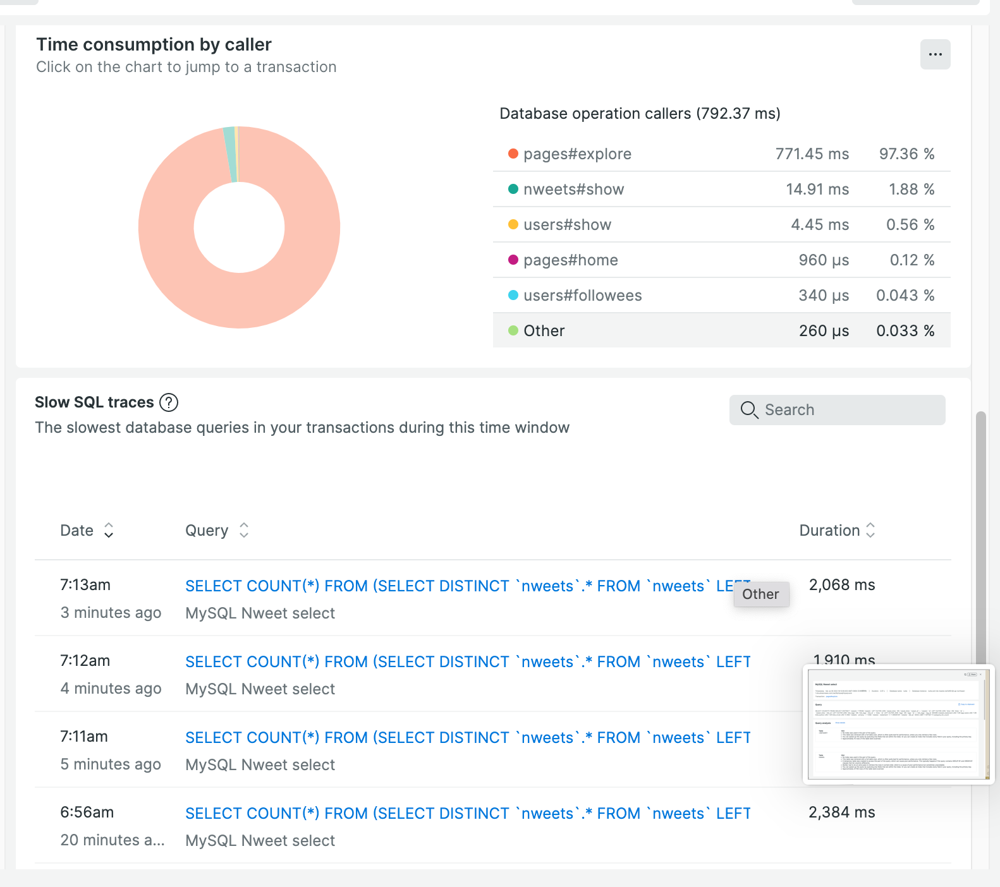
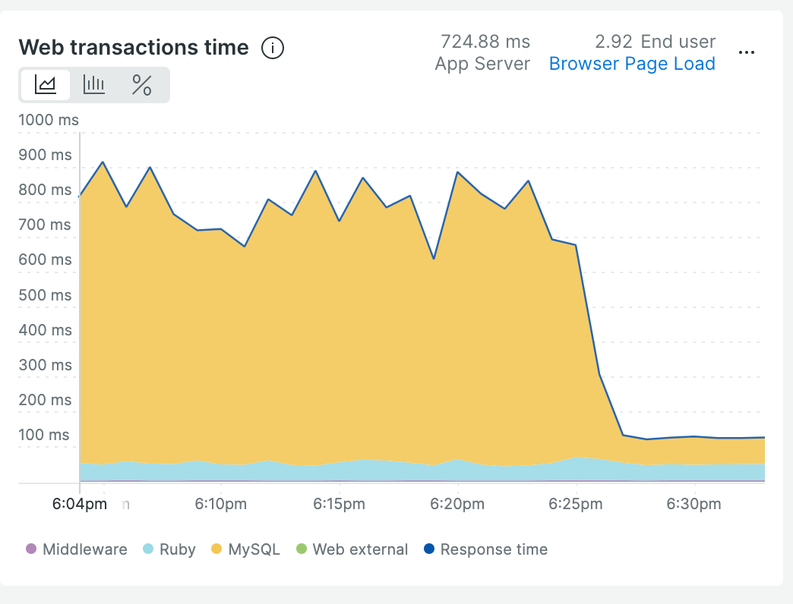

みなさんこんにちは！この記事は [KMC Advent Calendar 2022](https://adventar.org/calendars/8005) 2 日目の記事です。1 日目の記事は cc141 さんの [アドベントカレンダー執筆 RTA](https://cc141.hatenablog.com/entry/2022/11/30/184925) でした。かわいいなあウミディグダくん

私は KMC 40 回生の [kyp](https://github.com/kypkyp) です。3 年前から [Nuita](https://nuita.net/) という Web サービスを細々と開発しています。サービスの内容は成人向けなので詳しくは触れられないのですが、概ね Twitter や Mastodon のような SNS として認識していただいて問題ありません。

今回の記事では、この Nuita に今年加えた改修のうち、特に技術的に他人に話せるような内容のものを紹介していこうと思います。

なお、Nuita は [Rails チュートリアル](https://railstutorial.jp/) で作る Twitter もどきに毛が生えたような構造になっています。このコースが終わった方で、このあとどうしよう？と思っている人がいれば、この記事が改修のヒントになるかもしれません。なってくれたらいいな。

#### New Relic を導入した

厳密にいえばこれは改修ではないと思うのですが、監視ツールとして New Relic を導入しました。

これまで、Nuita の運用では先輩が導入してくれた [zatsu_monitor](https://github.com/sue445/zatsu_monitor) の Slack 通知を見る程度で、本格的な監視ツールは入れたことがありませんでした。

入れるの大変そうだし、個人開発の規模で監視とかいらんだろみたいなことを考えていたたためだと思います。が、他所でお世話になったのがきっかけで、New Relic を試してみたところ、思っていたよりはるかに簡単に導入できたし、その後は度々 New Relic に救われました。

まず、サービスのエラーレートやインフラの異常値が分かります。これまでは、何かをリリースしたあと、自分で適当に動作確認をしてエラーが出ないことを確認していました。検証としてはすごく雑なので、機能が増えていくに従い、意図していなかった部分での不具合が増えていきました。

実際、会員登録ページの不備に気づかず、1 週間程度新規ユーザーが登録できていなかったこともありました。そのときはお問い合わせで気づきましたが、サービス規模が小さければさらに長い間気づけなかった可能性もあります。APM 監視でエラーを把握できる現在では、同様のデグレがあればリリース後すぐに気付けるはずです。

また、APM 監視でレスポンスタイムを監視できることも大きな利点でした。個人開発だと、速度低下は見過ごしてしまいがちです。

が、New Relic を導入すると、くっっっっっっっっっっっそ遅くなっている箇所が客観的に分かります。SQL もエンドポイントも一発で分かるのが最高です。



<center><small>今見たらめっちゃ連続でスクショ撮ってた。恥ずかしい</small></center>

<p></p>

ということで、New Relic をガン見しながらスロークエリを直します。ガクッと数値が改善します。



快感ですね。

ちなみに、個人開発ならではの利点として、雑な検証にものすごく役立ちます。「このコード修正でパフォーマンス改善しそうだから一旦リリースしてみる。リリース前後のパフォーマンスを New Relic で確認し、効果出てなさそうだったら巻き戻す」みたいな。本番環境で ISUCON してる感じで楽しいです。真似してはいけない。

#### Elasticsearch を導入した

Elasticsearch による検索機能を導入しました。

これまでは RDB で簡易的な検索機能を実装していたのですが、検索条件が増えるたびに、SQL の WHERE 文が長くなっていてどんどん重くなる問題を抱えていました。そして、実際重くなっていたのですが、あまり自分では気づいていませんでした。

前述の New Relic でエンドポイントごとのトランザクション数やレスポンスタイムが見られるようになったことで、検索機能が頻繁に使われていること、なおかつめちゃくちゃ遅いこと（ざらに 1 秒以上レスポンスにかかっていた）ことが分かりました。

Elasticsearch は超すげーオープンソースの検索エンジンで、わりと複雑なクエリでも高速(数十 ms)に叩くことができます。これを Nuita に組み込むことで、検索画面は速度だけでなくヒット数でも改善するようになりました。現在は、おすすめの投稿など一部の機能でも内部的に Elasticsearch を使用しています。

なお、インデクシング(データの Elasticsearch への登録)は Active Job を使って非同期に行っています。[この記事](https://qiita.com/katsuhisa__/items/264f0c0c2085e6c27bd2)を参考にした記憶がありますが、Adopter には Redis を使う Sidekiq ではなく Amazon SQS を使う [Shoryuken](https://github.com/ruby-shoryuken/shoryuken) を使いました。

Redis を立ち上げておく必要もないし、ロングポーリングを使用する設定にすればまず無料利用枠をはみ出ることもないし、Shoryuken を採用したのは良い選択だったと思っています。あと名前もかわいい。

また、Elasticsearch と Rails の接続に関しては [elasticsearch-rails](https://github.com/elastic/elasticsearch-rails) という gem を使っています。検索結果のチューニングやクラスタの最適化など、Elasticsearch の世界はまだまだ奥が深そうな雰囲気を感じています。いつか完全理解したい。

#### タイムライン表示を DynamoDB に置き換えた

Nuita には、Twitter や Mastodon のようにフォロワーの自分の投稿一覧が表示されるホーム画面が存在します。Rails チュートリアルでは、ホーム画面へのリクエストが来たタイミングで、`WHERE post.user_id IN (1, 2, 6 ...)` という感じの SQL で絞り込みます。

Nuita でも、Rails チュートリアルと同様の仕組みを取っていましたが、速度面の都合(SQL の IN 句は遅い！)と、表示内容の柔軟性に問題がありました。

このため、「ホーム画面にアクセスするたびに SQL で表示するヌイートを決定する」のではなく、「事前にユーザーごとのタイムラインを生成しておき、アクセス時にはそのタイムラインの詳しい情報だけを SQL で取得する」という仕組みに変更しました。

具体的には、DynamoDB にユーザーの ID とそのユーザーのタイムラインに表示されるヌイート ID が 1 つずつ保存されています。新たにヌイートが投稿されると Active Job がキックされ、そのヌイートが表示されるべきユーザー 1 人 1 人に対してヌイート ID が追加されます。

新たなユーザーをフォローしたときや、お気に入りタグを編集したときなどには、別の Active Job が走り、SQL を使ってタイムラインの中身を 1 から計算し、再び DynamoDB に保存します。これらの処理は非同期で行われるので、ユーザーがタイムラインを表示する際には「ID の配列を元に、Active Record でヌイートの一覧を取得し表示する」という比較的軽い処理で済みます。

また、タイムラインの中身が直接 SQL に従わずに済むので、レコメンドや順番の入れ替えなど、「タイムラインの中身を SQL 以外の条件でカスタマイズしたい」という要望にも応えられるようになりました。

なお、DynamoDB や全体的なシステムの設計に関しては、次の記事を全面的にパクリました。[CyberZ が Amazon DynamoDB を使用してフォロータイムラインの表示に必要な Read-Light 方式を実現した方法](https://aws.amazon.com/jp/blogs/news/how-cyberz-performs-read-light-operations-to-display-followees-activities-in-the-timeline-using-amazon-dynamodb/)

あと、「与えられたヌイート ID の配列通りに、Active Record で情報を取得する」というのがわりと大変でした。[`order_as_specified`](https://github.com/panorama-ed/order_as_specified)という gem を使うことで回避しましたが、かなり脳筋感のある SQL が出力されます。

```ruby
nweet_ids = [546978900, 237096952, 26374316, 302432724]
Nweet.where(id: nweet_ids).except(:order).order_as_specified(id: nweet_ids).to_sql
 => "SELECT `nweets`.* FROM `nweets` WHERE `nweets`.`id` IN (546978900, 237096952, 26374316, 302432724) ORDER BY `nweets`.`did_at` DESC, (CASE WHEN `nweets`.`id` = 546978900 THEN 0 WHEN `nweets`.`id` = 237096952 THEN 1 WHEN `nweets`.`id` = 26374316 THEN 2 ELSE 3 END) ASC"
```

パフォーマンス的にも良くない気がするので、例えば部分的に Active Record を諦めて配列で渡しちゃうとか、色々考え中です。ただ、毎回 SQL で表示内容決めてた頃よりは格段に早くなったので、導入するだけのメリットはあったかなと思っています。

#### まとめ

今年は Nuita 以外のことが忙しく(Vic3 発売おめでとうございます!)、あまりまとまった時間を Nuita にかけることができませんでした。

そのため、サービスの新しい機能を作るとか、UX を作り込むとかのトライアンドエラーの必要な開発ができず、代わりにゴールが明確で迷いづらいインフラ側の改修が中心になった気がします。

来年はかなり長い時間を個人開発に割ける算段がついているので、「たくさんのユーザーに使ってもらえるサービスにする」というほうを頑張っていきたいです。

俺たちの個人開発はこれからだ！

_この記事は [KMC Advent Calendar 2022](https://adventar.org/calendars/8005) 2 日目の記事でした。明日の担当は tamaron さんで「GCC Rust」です。お楽しみに!_
