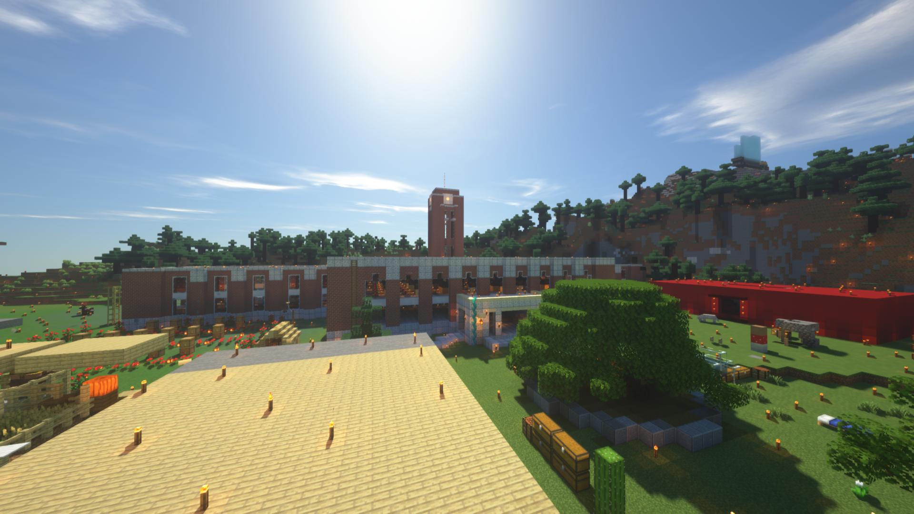
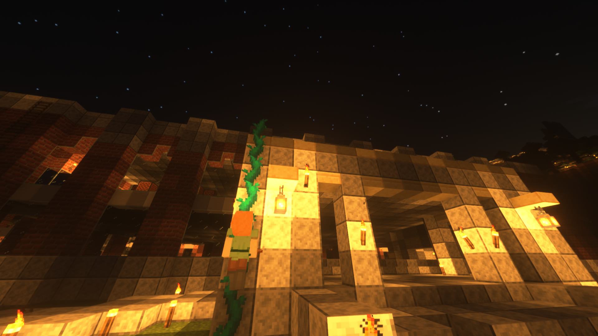
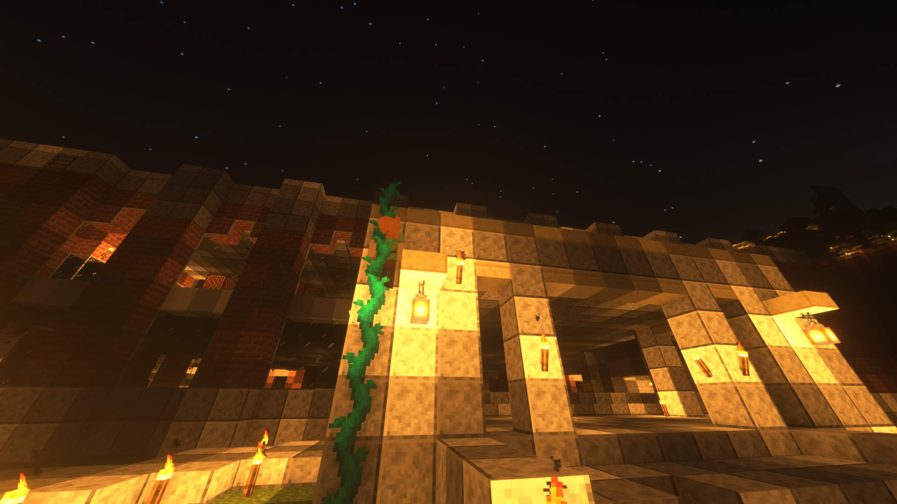
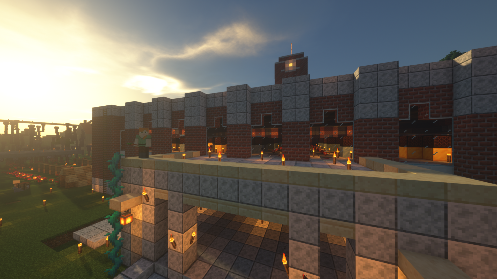
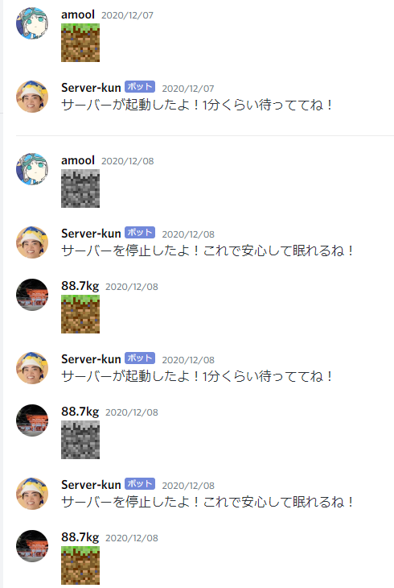
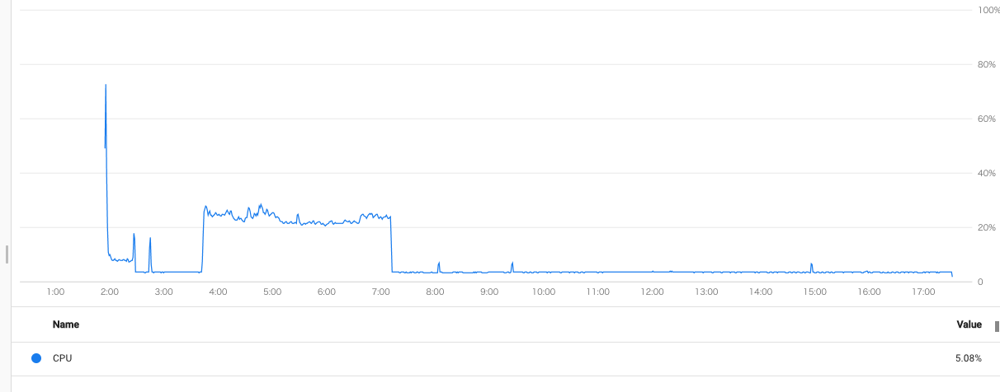
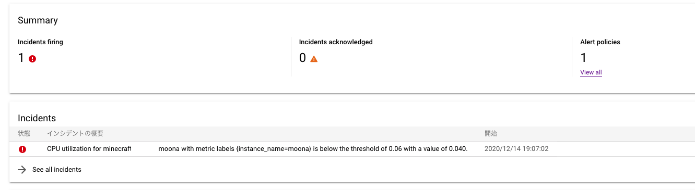
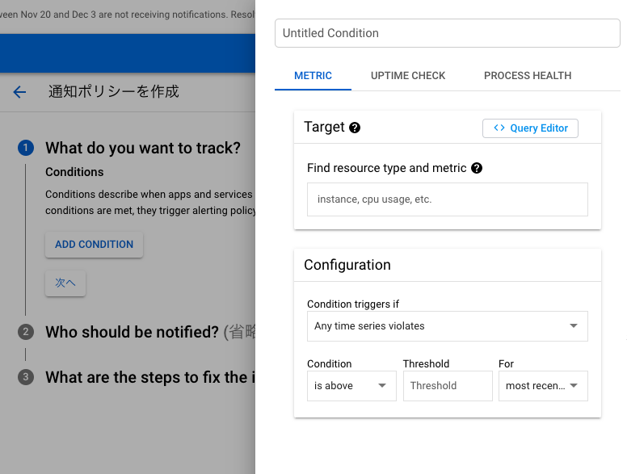
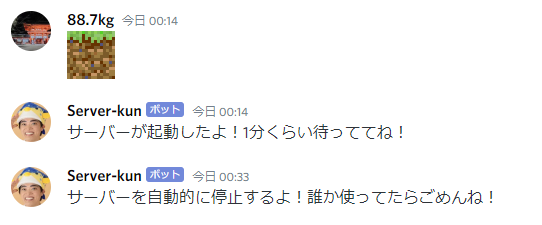

この記事は [KMC アドベントカレンダー 2020](https://adventar.org/calendars/5654) 14 日目の記事です。前日の記事は morisawa さんの [Anima2D でシーンビューからメッシュが消えたときの原因とその対処法](https://qiita.com/mori-memo/items/a4b7fac1abe62dda1fb1) でした。

#### はじめに

こんにちは、[kyp](https://twitter.com/_kypu_) です。[KMC](https://kmc.gr.jp) はパソコンを使ってワイワイする人が集まるサークルであり、Discord 上でも FPS からワードウルフまで、多種多様なゲームを利用した交流が昼夜を問わず行われています。

そのゲームの 1 つに Minecraft があり、現在のサーバーには、



某大学に似た時計台があります。

ハシゴはありませんが、なぜかツタがつたっているので、





登ることができます。



現実世界ではもう実際に叶わないことを叶えられるのが、ゲームの素晴らしいところです。

もちろん、Minecraft は誰かが用意したサーバーに全員で接続する方式を取るわけですが、個人の管理では意図せず電源が切れたり、あるいはサーバーのスペックが足りなかったりという問題が生じがちです。そこで先月あたりにサーバーを GCE 上に構築し、ついでに Discord からいい感じに起動できるようにするようにしてみました。今回はその流れと知見をざっくりと書いていこうと思います。

なお、今回書いたコードは以下のレポジトリにあります。

[kypkyp/server-kun: Github](https://github.com/kypkyp/server-kun)

GCP にも AWS SAM のような IaC の仕組みがあるようなので、本当は 1 クリックでデプロイできるプロジェクトを生成したかったのですが、時間と知識不足でコード単体の状態で放り出してしまいました……。再利用する場合は意図を汲みながら気合で手動デプロイしてください。すみません。

#### 1. GCE のインスタンスを建てる

GCE(Google Compute Engine) は GCP(Google Cloud Platform) のサービスの 1 つですが、要はクラウド上に仮想マシンを立ち上げて使えるというシンプルな機能です。AWS 上の EC2 に相当するもので、ゲームサーバーの運用にはどちらも問題なく利用できると思うのですが、今回は無料利用枠が余っていた関係で GCE を選択しました。

一度立ち上げてしまえばあとは普通のサーバーに繋いでいるのと全く変わらないので、ゲームごとのチュートリアルの通りにセットアップしてしまえると思います。Minecraft の場合は公式にドンピシャの記事があります（[Compute Engine での Minecraft サーバーの設定](https://cloud.google.com/solutions/gaming/minecraft-server)）。後半の内容は自分の用途では必要ありませんでしたが、「始める前に」〜「サーバー実行」の部分は非常に詳細で分かりやすかったです。

注意点を 1 つ挙げるとすれば、それは VPC の設定です。GCP では VPC (Virtual Private Cloud) という機能で外部とのインターネットとのネットワークが遮断されているため、インスタンス内部の設定だけではゲームに必要なポートを開けることができません。このため、開放したいポートがある場合は VPC ネットワークの管理画面を開き、特定のインスタンスにだけ特定のポートのトラフィックを許す、といったルールを作成する必要があります。

この辺は上の記事にも一通りの流れが書いてありますので、ぜひ試してみてください。個人的な雑感としては GCP の UI は AWS よりも明るくて分かりやすく、日本語の公式ドキュメントも充実しているので知識がなくてもあまり困らなかったです。また、VPC の設定をするには自分が必要なゲームがどのポートを使うか知っている必要がありますが、この辺もゲームの名前で検索すればたぶん大丈夫です。

#### 2. ゲームサーバーをデーモン化する

インスタンスとネットワークの設定が済んだら、実際に必要なゲームサーバーをインストールして、手元の PC からアクセスできるか試してみましょう。

できましたか？おめでとうございます！さあゲームを遊びましょう！と言いたいところですが、次にこのゲームサーバーをデーモン化する必要があります。

デーモン化とは要はサーバーを立ち上げたら自動的にゲームも起動するように設定することです。デーモン化がされていると、実際のサーバーに SSH して立ち上げる手間が減りますし、後述する Discord 経由の遠隔起動の為には必須になります。

デーモン化には色々な方法があるので、これもゲームごとに調べて出てきたものを試してみるのがいいと思います。自分が地味にハマったのがこのあたりで、systemd を用いた方法を試したのですが、設定ファイルのオプションが微妙にズレていたりして使えませんでした。後になって分かったのですが、GCP には startup-script というオプションがあり、それをインスタンスの管理画面に設定することで起動時に特定のスクリプトを走らせることができるようです。上掲した GCP のドキュメントに Minecraft の例があるので、systemd で大苦戦した場合には検討してみてください。

#### 3. Cloud Functions 経由でサーバーを起動/停止する

これでクラウド上にサーバーを立ち上げることに成功しました！インスタンスの詳細画面から IP アドレスをコピーして、Discord のチャンネルに貼って友達に自慢しましょう。

数日後、あなたは何気なく Google Cloud の請求画面を開き、1 万円あった無料枠が恐ろしい勢いで食い潰されていることに気づくはずです。そう、ゲームサーバーは何気にスペックを要求されるもので、何人かで快適に遊べる規模のものを構築するだけでも月数千円の課金が必要になるのです（参考までに、現在の Minecraft サーバーは vCPU x 4, メモリ 8GB の構成で動いていて、これは 1 ヶ月フルで動かし続けたら 7000 円近くになります）。

しかし焦ることはありません。よほど大規模のサーバーを運用していない限り、プレーヤーがサーバーを利用する時間は限られていて（深夜とか）、それは 1 日の半分にも満たないはずです。重要な事実として、GCE の料金体系は **時間課金** です。このため、使わない時間にシャットダウンし、必要な間だけサーバーを起動している仕組みを作れば、課金額を大幅に削減できることになります。

KMC 鯖の場合、幸いなことにプレイヤーは全員 Discord に入っていて、大体ゲームも音声や文字でチャットしながら遊んでいます。このため、Discord を通してサーバーを起動・停止できる仕組みを作れば、ほぼストレスなしに使ってくれるでしょう。

これを実現するために、まずは Cloud Functions 経由でサーバーを起動/停止できるようにします。Cloud Functions は HTTP のリクエスト等をトリガーにして特定の関数を実行できるサービスで、要は GCP 版の AWS Lambda です。

HTTP イベントとして関数を定義すると、デプロイと同時に URL が渡され、その URL にアクセスするだけで関数の中身が実行されます。そこで Start, Stop という関数を定義することによって、特定の URL を叩くだけでサーバーが起動/停止できるようになるという算段です。Web サービスとかの場合は絶対に書けない処理を気楽に書けるのが良いですね！

```go
// import ...

// ServerConfig is a set of properties which specify an instance.
type ServerConfig struct {
	Project  string
	Zone     string
	Instance string
}

func readServerConfig() *ServerConfig {
	p := os.Getenv("SERVER_PROJECT")
	z := os.Getenv("SERVER_ZONE")
	i := os.Getenv("SERVER_INSTANCE")

	return &ServerConfig{p, z, i}
}

// Start starts a GCE instance.
func Start(w http.ResponseWriter, r *http.Request) {
  s := readServerConfig()
  ctx := context.Background()

  // 以降、この記事のコードでは err != nil みたいなコードを全て省略します
  gcpClient, err := google.DefaultClient(ctx, compute.CloudPlatformScope)

	computeService, err := compute.New(gcpClient)

	res, err := computeService.Instances.Start(s.Project, s.Zone, s.Instance).Context(ctx).Do()
}
```

これを[環境変数を突っ込んだファイルと一緒にデプロイ](https://cloud.google.com/functions/docs/env-var)すれば OK です。

プログラム的には GCP のライブラリを呼んでいるだけですが、このライブラリのドキュメントや使用例がどこにあるか少し分かりづらいです。Godoc 等のドキュメントを見ても正直よく分からないですが、実際には [GCP の API リファレンス](https://cloud.google.com/storage/docs/apis?hl=ja)がとても役に立ちました。API 自体のリファレンスと思いきや、下にスクロールすると各言語ごとのライブラリでラップした使用例もみることができます(例: [Methods: Instance.Start](https://cloud.google.com/compute/docs/reference/rest/v1/instances/start?hl=ja))。特に GCP 自体に慣れていない場合、知らない概念が多すぎて訳が分からなくなってしまうので、このリファレンス等の使用例を積極的にコピーして使っていくのが良いと思います。

また、Cloud Functions に Lambda Layers 的なものがなく、各関数で共通する処理をまとめられないのが少しつらいところです。デプロイ時の工夫で共通のライブラリを参照できるようにできるようですが、今回は実行せず、愚直にコピペ作戦で行くことにします。Stop のコードも GitHub のレポジトリにありますのでご覧ください。ほぼ一緒です。

#### 4. Discord の書き込みを監視する

これで HTTP リクエストを通して手軽にサーバーを起動・停止できるようになりました。URI を直接叩いてもいいのですが、まず面倒くさくなって停止されなくなる（そしてお金が無駄にかさんでいく）未来が目に見えるので、Discord 経由でその URI を叩けるようにしましょう。つまり、Discord で特定のコマンドを打つと Bot が反応し、Cloud Functions のエンドポイントを叩いてサーバーを起動する、というピタゴラスイッチを考えます。

Slack の場合は Event Subscriptions API というものがあり、Slack 上で特定のイベントがあると**Slack から**特定の URI を叩くことができるようです。これがあれば、例えば特定のチャンネルで発言があるたびに Cloud Functions を叩かせたりすることができそうです。

しかし、Discord の場合は Webhook で**Discord へと**メッセージを送ることはできますが、**Discord の方から**何かを送る機能はなく、したがって Discord 上の発言に反応するためには常時プログラムでコネクションを貼っておく必要があります。ですから、実行時間に限りのある Cloud Functions では Discord の書き込みに反応することはできません。

そこで適当なサーバー or コンテナでプログラムを常時動かし、Discord の書き込みを監視しつづける必要があります。今回は GCE 上でインスタンスを別途借りて監視プログラムを走らせることにしました。例えば VPC 外から Cloud Functions にアクセスできるようにするリスクを考えると、これは仕方のない決断かと思います。最小構成ではありますが、結局別のインスタンスが 24 時間走り続けることになりました。

……あまり節約にならない気がしてきましたね。今回は [DiscordGo](https://github.com/bwmarrin/discordgo) というライブラリを使って監視プログラムを作りましたので、[そのコードを GitHub に載せておきます](https://github.com/kypkyp/server-kun/tree/master/apps/receiver)。

#### 5. 一定の使用率以下で自動的に停止する

さて、Discord 経由で Cloud Functions を叩き、Cloud Functions が GCE の API を叩いてインスタンスを操作するというピタゴラスイッチが完成しました。

実際にこの bot を動かすと、Discord のチャンネルはこんなふうになります。



ほっこりしますね。

しかし、起動させるときはともかく、サーバーを停止させるタイミングまで書き込みが必要なのはどうかという気もします。なぜなら、誰も遊んでいないときは明らかに CPU 使用率が低下するので、CPU 使用率が明らかに低下するからです。



クラウドの機能で常にインスタンスをモニタリングしてくれているのですから、それをうまく使えばサーバーの自動停止を実現できそうです。

そして、実際にできます。試してみましょう。

今回は GCP の Monitoring 機能と Cloud Functions の合わせ技です。GCP には Monitoring 機能があり、同じプロジェクトのリソースの状況に応じてアラートを出すことができます。

アラートは GCP のコンソールでは「Incident」として記録されていて、気軽に制御のために使ってはいけなそうな見た目をしていますが、一旦忘れましょう。



まずは発火した際に呼び出される Cloud Functions を作成します。この関数は Discord に自動起動の旨を通知し、(3)で作った Stop 関数を呼び出すだけのものです。自動通知には Discord の Webhook を使っているので、DiscordGo 等を使ってコネクションを貼る必要はありません。

まずは CloudFunctions の関数を作成しましょう。自分の場合は以下のようなものになりました。

```go
// import ...

// RequestBody defines a JSON that will be sent to Discord webhook.
type RequestBody struct {
	Content string `json:"content"`
}

func postDiscord() {
	hook := os.Getenv("DISCORD_HOOK")
	c := os.Getenv("AUTOSTOP_MESSAGE")

	rb := RequestBody{Content: c}
	fmt.Println(rb)

	json, err := json.Marshal(rb) // err != nil ...系のコードは省略
	_, err = http.Post(hook, "application/json", bytes.NewBuffer(json))
}

func stopServer() {
	hook := os.Getenv("STOP_HOOK")

	rb := RequestBody{}
	json, err := json.Marshal(rb)

	_, err = http.Post(hook, "application/json", bytes.NewBuffer(json))
}

// Autostop stops a server and send a notification to Discord.
func Autostop(w http.ResponseWriter, r *http.Request) {
	postDiscord()
	stopServer()
}
```

これをデプロイして、Monitoring の管理画面の「EDIT NOTIFICATION CHANNELS」からこの関数の URI を登録します。

次に同じ画面から「CREATE POLICY」を選択し、実際にアラートが呼び出される条件を設定します。



けっこう柔軟に指定できるので迷いますが、自分の場合は「CPU 使用率が 5 分間 6%を下回り続けたら」という設定にしました。

このあたりは実際に動かしてみて、どのくらいが閾値としてちょうどいいかを探りながら設定する必要がありそうです。

ともかく、これで無事に自動的に CPU 使用率を判断してシャットダウンできるようになりました！これでお財布も一安心です。



#### おわりに

非常に長くなってしまいましたが、ここまで GCP と Discord で構築したいい感じのゲームサーバーについてざっと見てきました。

いい感じのゲームサーバーを立てたいという欲とクラウドに触ってみたいという欲がごちゃごちゃになり、後で振り返ってみるともう少し簡略化できた気もしますね！

この記事がお金を節約しながらクラウドにゲームサーバーを立てたい誰かの役に立つとともに、今回立てた Minecraft サーバーにもっと人が集まるよう願っております。そうえいば、KMC に入部すると誰でもサーバーに入れると思います。Minecraft がやりたいあなたもぜひ入部してみてください！

さて、明日の KMC アドベントカレンダーは TKMAX さんです。お楽しみに！
