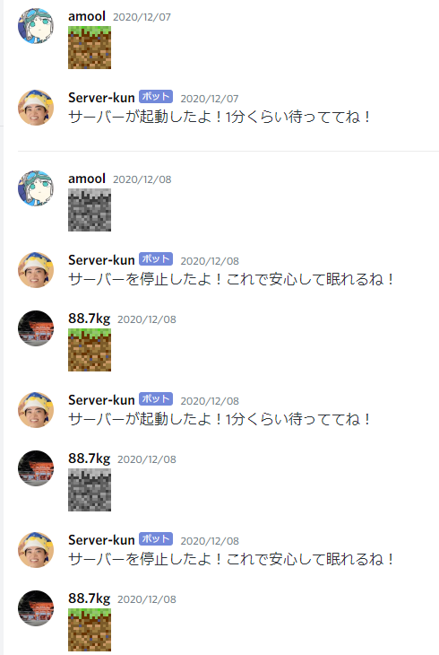
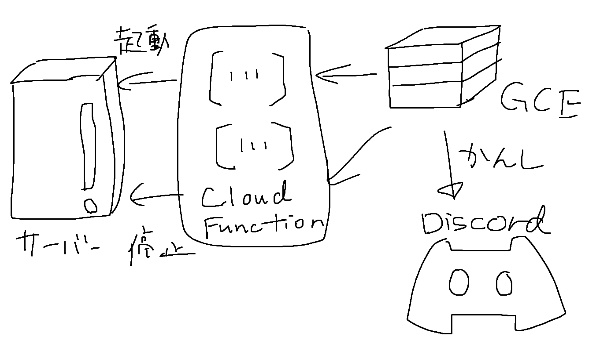

この記事は[KMC Advent Calendar 2021](https://adventar.org/calendars/6895) 17 日目の記事です。

昨日の記事は machida くんの　　　でした。記事書けてないみたいですけど VALORANT してて大丈夫ですか？

### 概要

Discord の発言から GCE のサーバーを起動・停止し、サーバーの使用料を削減できる[server-kun](https://github.com/kypkyp/server-kun)という bot を IaC 化しました。1 コマンドで……とはいきませんが、4 ステップくらいでお使いの Discord サーバーに導入できます。ぜひお試しください！

[レポジトリ](https://github.com/kypkyp/server-kun)  
[日本語の README もあります](https://github.com/kypkyp/server-kun/blob/master/README.ja.md)

### 以下余談

書くことがなくなってしまったので、軽く今回やったことの説明をします。

server-kun は今から 1 年前に誕生しました。Minecraft のサーバーを GCP 上に構築したのですが、そこそこ強いインスタンスを組んだらあっという間に無償のクレジットを使い切ってしまい、このままだと毎日のエナドリ代がなくなってしまうというサーバー管理者（僕）の危機感がきっかけでした。

そして、せっかく Go とか Cloud Functions とかを触れたので、その様子を昨年の KMC アドベントカレンダーの[記事として投稿しました](../server-kun)。

あれから 1 年。

変わらない日々、募る焦燥感。

僕は、この 1 年で何を成し遂げたのだろうか？

導入の仕方だけですら 8000 文字近くなってしまった昨年のアドベントカレンダーを読み返します。意気揚々と貼り付けた GitHub のレポジトリに Star はありません。当然です。導入の仕方を理解するのにすら 8000 文字近く読まなければいけないのですから。

そんなとき。

Discord の#minecraft チャンネルで、別鯖に『discord からマイクラ鯖を起動したりシャットダウンしたりできる」という bot を作ろうとしている人がいるので、参考に server-kun を紹介していいか』、と聞かれました。

そうか。

昨年、自分が費用を削減したいというだけの理由で生まれた server-kun。他人が新規に類似の bot を作る気がなくなるくらい、その server-kun を使いやすく導入しやすいものにし、実際に赤の他人にも使われるようになれば、それはこの 1 年で僕が成長したということにならないだろうか？

かくして server-kun IaC 化の試みは始まりました。

### 技術

オタク向けに技術的なことを書きます。

server-kun の詳細は[昨年の記事](../server-kun)に詳しく書かれていますが、大まかな構成図は次のようになります。

Receiver と呼んでいる GCE が Discord の発言を受け取り、特定の文字列（今回だと`:minecraft-start:`, `:minecraft-stop:`という絵文字）を含む発言があったら Cloud Function を呼び出し、Cloud Function が対象サーバーの API を叩いて起動/停止を行う、という構成です。

今回はこの Cloud Function, GCE の部分を Terraform で IaC 化しました。実際に起動させたいサーバーは作らず、Terraform の変数としてインスタンス名を与えるようにしています。なので、サーバーがどんな OS であろうとスペックであろうと動かせますし、やっぱ使いづらいし金もあるから server-kun いらんわ、ってなったときも server-kun だけを`destroy`することができます。

Cloud Function と GCE を terraform で作るのは、IAM とかの細かい部分を除けば非常にスムーズでしたが、Receiver が立ち上がるようにするのが大変でした。いっそ Docker 化して、Cloud Run として Receiver を動かす……みたいなことをすれば比較的簡単な気がするんですが、[GCP の無料利用枠に関する説明](https://cloud.google.com/free/docs/gcp-free-tier/#cloud-run)を見る限り最大でも月 50 時間しか無料にならない（であってるよね？間違ってたらごめん）ようなので、リージョンとスペックを選べば 1 ヶ月無料で動かせる GCE しか使えなかったという背景があります。

`terraform apply`だけで無理やり Receiver を起動するために、[雑に書いたシェル](https://github.com/kypkyp/server-kun/blob/master/infra/scripts/setup_receiver.sh)で GitHub の Releases からバイナリを引っ張ってきて systemctl のサービスとして登録する、みたいなことをやっています。

で、これを書いてて思ったんですが、Discord に最近[Application Commands](https://discord.com/developers/docs/interactions/application-commands)という`/hoge`みたいな形式で bot を呼ぶ API が追加されていて、これを使えば常時レシーバを立ち上げていなくても向こうからエンドポイントを叩いてくれるので、苦労してレシーバーを作る必要すらなくなるかもしれないです。

去年 server-kun を作った段階では、使用している Discordgo というライブラリが対応してなかった気がするんですが、現在は release こそされていないものの、master ブランチを指定して`go get`することで使用できるようになっているみたいです。こんな技があるのすら知らなかった。

というか今この記事を書いていて知ったのですが、Discord からメッセージを受け取る今の bot の動かし方は 2022 年 4 月に廃止され、今後はスラッシュコマンドでの呼び出しだけが使えるようになるみたいです。

[GrapeColor - discord.py 開発終了の衝撃・BOT 利用者への影響](https://note.com/grapecolor/n/nb16071ae81bf)

[The Future of discord.py](https://gist.github.com/Rapptz/4a2f62751b9600a31a0d3c78100287f1)

 

記事書き始めるまでこういう状況になってるの知らなかった……。

色々読んでいて悲しい気持ちになったのでここでこの記事を終わります。来年の Advent Calendar のタイトルは「server-kun を停止しました」かも。

_この記事は[KMC アドベントカレンダー](https://adventar.org/calendars/6895)17 日目の記事でした。[KMC](https://www.kmc.gr.jp/)のホームページも合わせてご覧ください。_
