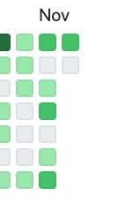

今日は 10 時半に起きて、こないだ届いた Google Pixel で Twitter や Youtube を眺め、それから昼ごはんを食べた。そのあと支払いを済ませるために少し出かけて、また家に戻ったら電話がかかってきた。楽天カードからの連絡で、自動音声のオペレーターに滞納金の催促をされた。さっき払ったばかりなのに。悲しくなって射精して、そのままベッドで寝たら 17 時になっていた。

午前中に起きている時点で学生のときより相当進歩しているんだけど、学生のときと違って休みは週に 2 日しかない。貴重な休日を浪費してしまった（こんな四十肩の大人みたいな言葉をブログに書く人間になりたくなかった！！！！！！！）

[Write Code Every Day](https://johnresig.com/blog/write-code-every-day/)という言葉があるらしい。つまり、毎日コードを書くということだ。

怠惰はプログラマの美徳ということもあるけれど、僕はああいう良い意味の怠惰ではなく、単に飲酒とかゲームとか色々な誘惑に負けてタスク自体を放棄する最悪なタイプの人間だ。仕事が始まったら案の定他のことにやる気が出なくなってしまって、[Nuita](https://nuita.net/)やらの外に見せられるコードを書く気が全く起きなくなってしまっている。

質より量みたいなアプローチは全く好きじゃないんだけど（元記事はそういう話じゃないんだけど、やっぱり自分で実践するとどうしてもそうなっちゃうと思う）、それでもその時のやる

追記: 全然だめでした

